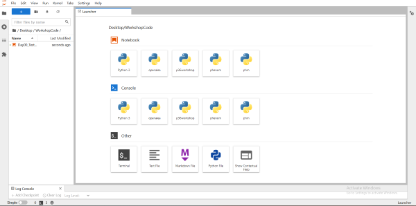

### How to install Jupyter Lab on Linux x86:
For the use of GUI packages on Linux, you will need to install the following dependencies for your specific verison of Linux.

Copy these into the terminal for your version <br>
### *Debian* :
```
sudo apt-get install libgl1-mesa-glx libegl1-mesa libxrandr2 libxrandr2 libxss1 libxcursor1 libxcomposite1 libasound2 libxi6 libxtst6
```


### *RedHat*:
```
 sudo yum install libXcomposite libXcursor libXi libXtst libXrandr alsa-lib mesa-libEGL libXdamage mesa-libGL libXScrnSaver
```

### *ArchLinux*:
```
sudo pacman -Sy libxau libxi libxss libxtst libxcursor libxcomposite libxdamage libxfixes libxrandr libxrender mesa-libgl  alsa-lib libglvnd
```

### *OpenSuse/SLES*:
```
sudo zypper install libXcomposite1 libXi6 libXext6 libXau6 libX11-6 libXrandr2 libXrender1 libXss1 libXtst6 libXdamage1 libXcursor1 libxcb1 libasound2  libX11-xcb1 Mesa-libGL1 Mesa-libEGL1
```
### *Gentoo*:
```
sudo emerge x11-libs/libXau x11-libs/libxcb x11-libs/libX11 x11-libs/libXext x11-libs/libXfixes x11-libs/libXrender x11-libs/libXi x11-libs/libXcomposite x11-libs/libXrandr x11-libs/libXcursor x11-libs/libXdamage x11-libs/libXScrnSaver x11-libs/libXtst media-libs/alsa-lib media-libs/mesa
```
### 1. Firstly, install the Anaconda Installer for Linux 
https://www.anaconda.com/download/#linux
### 2. It's recommended that you verify the data with SHA-256, although it isn't necessary. To do so, enter:
```
sha256sum path/to/your/file
```
TIP: For an easy way to find the full directory of a file, enter readlink -f *filename*
Once you've verified the integrity of your file, you may move on.
### 3. Next, enter this to install Anaconda:
```
bash ~/Downloads/Anaconda3-2022.10-Linux-x86_64.sh
```
NOTE: The numbers for the year are dependent on file name. Also, you can rename the file to make it easier to enter.

### 4. Accept any terms and conditions the installer asks for. 
### 5. If you wish, you can change the installation directory as well. 
### 6. The installer will prompt if you'd wish to initialize Anaconda3 by running conda init. Select "yes".
### 7. Anaconda installation is complete!
### 8. To have the installation take effect, close the terminal or type
```
source ~/.bashrc
```
### 9. To verify that the installation proceeded correctly
Go back into the Linux terminal and enter `conda list`. If Anaconda is working properly, it should show up in the list of packages.

### 10. Enter the command `python` 
If Anaconda is installed, it should be displayed with version information. To exit the python shell, type `quit()`.

### 11. To open the Anaconda Navigator
Type `anaconda-navigator`.

### Now we can install the workshop material.
 ### 1. Making and activating an environment for the packages we're going to install 
Please make and then activate a new Anaconda environment specifically for this workshop. You can do this by opening up the **Linux Terminal** and typing:

```
conda create --name ModelingWorkshop
```

Followed by

```
conda activate ModelingWorkshop
```

You'll then carry out all the following steps in that environment. Note that each time you start up the Anaconda Prompt to launch into Jupyterlab for our exercises, you'll need to first type 


```
conda activate ModelingWorkshop
```

before proceeding.


### 2. Install JupyterLab

From the **Linux Terminal**, enter the following code:

```
pip install jupyterlab==3.3.2
```
This will install JupyterLab, the interace we'll be using to interact with the metabolic modeling simulations, onto your system. If any (y/n) prompts come up during the installation, enter "y", without the quotation marks, and press enter. Once the installation is complete, confirm that everything worked by typing the following into the **Linux Terminal**:
```
jupyter lab
```
A page with an interface like the one in the image below should show up in your default browser. Leave that open for now while we install the rest of the required packages.



### 3. Install ipykernel

From the **Linux Terminal**, type 

```
conda install ipykernel==6.9.1
```
Once you've done that, type
```
ipython kernel install --user --name=ModelingWorkshop
```

### 4. Install seaborn

From the **Linux Terminal**, enter the following code:

```
pip install seaborn
```

### 5. Install ipywidgets

As you will see, the metabolic models we'll be working with have interactive sliders to allow you to vary parameter values. For this functionality, we'll need the latest version of the ipywidgets package. As before, from your **Linux Terminal**, type in and execute the following code:

```
pip install ipywidgets
```
If any (y/n) prompts come up during the installation, enter "y" and press enter.

### 6. Install cobrapy

In order to demonstrate Flux Balance Analysis (FBA) modeling, we'll need the Python distribution of COBRA. As before, from your **Linux Terminal**, type in and execute the following code:

```
pip install cobra
```
If any (y/n) prompts come up during the installation, enter "y" and press enter.

### 7. Install mfapy

In order to demonstrate Metabolic Flux Analysis (MFA) modeling, we'll need a python package called *mfapy*. This is slightly more involved than the installations for the other packages. 

a. Go to https://github.com/fumiomatsuda/mfapy

b. Download a .zip file of the contents of the repository and unpack it somewhere easy to navigate to on your system.

c. Open the **Linux Terminal**

d. First, we need to install some dependencies. Type and enter:

```
conda install -c conda-forge nlopt
```
e. Next, type and enter:
```
conda install -c anaconda mkl-service
```
f. Navigate to the folder you unpacked on your system by typing
```
cd *path here*
```
For example, I unpacked the folder onto my Desktop, so I typed in:
```
cd C:\Users\Joshua Kaste\Desktop\mfapy-master
```
g. Type and enter:
```
python setup.py install
```
h. If any (y/n) prompts come up during the installation, enter "y" and press enter.

### 8. Confirm that everything is running

We have a quick test notebook you can run to ensure that everything is installed correctly and functional. On the Metabolic Modeling Lessons GitHub page, you should see a bright green "Code" button to the top right of the file browser above all of this instructional text. Please click that and then select the bottom-most option on the drop-down (**Download Zip**) to download the contents of this GitHub repository. Once you've done that, unpack the contents of the repository to wherever is most convenient for you on your system. Then, **from the JupyterLab interface** in your browser, navigate to the folder you just unpacked. There will be a file titled
```
Day00_TestNotebook.ipynb
```
in the folder. Close out of the Anaconda Prompt you were in before, open it up again, and activate the workshop environment with:

```
conda activate ModelingWorkshop
```

Then, type:

```
jupyter lab
```

Open this in JupyterLab and you should see something like the image below. In the top-right of the Jupyter lab interface you should see a small circle with a name next to it - click the name and you'll be presented with a list of "kernels" to choose from. Select the **"ModelingWorkshop"** option. Then, follow the instructions in the notebook to run the single block of code in. Scroll down to confirm that the output below the code reads: "All Good!". 
